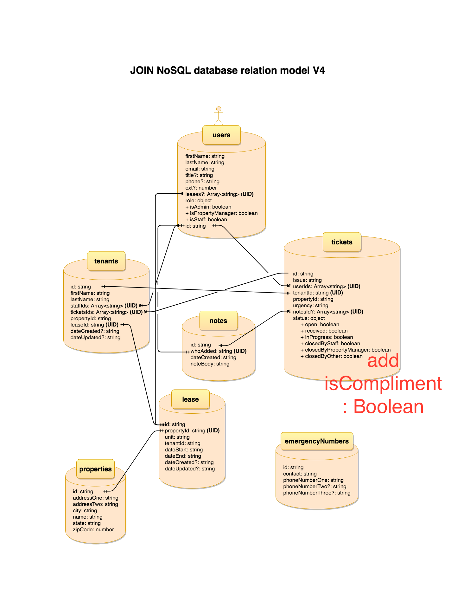

# JOIN API v1

---

## /api/

#### _Staff and Admin access_

#### ACCESS POINT: `https://us-central1-join-thingy-v01.cloudfunctions.net/api/`

#### ENDPOINT: USERS

| method | route           | action                 |
| :----- | :-------------- | :--------------------- |
| POST   | `v1/users/`     | Creates a new user     |
| GET    | `v1/users/`     | Gets all users         |
| GET    | `v1/users/:uid` | Gets a single user     |
| PATCH  | `v1/users/:uid` | Updates a single user  |
| PUT    | `v1/users/:uid` | Archives a single user |
| DELETE | `v1/users/:uid` | Deletes a single user  |

 

#### ENDPOINT: PROPERTIES

| method | route                | action                     |
| :----- | :------------------- | :------------------------- |
| POST   | `v1/properties/`     | Creates a new property     |
| GET    | `v1/properties/`     | Gets all properties        |
| GET    | `v1/properties/:uid` | Gets a single property     |
| PATCH  | `v1/properties/:uid` | Updates a single property  |
| PUT    | `v1/properties/:uid` | Archives a single property |
| DELETE | `v1/properties/:uid` | Deletes a single property  |

 

#### ENDPOINT: EMERGENCY NUMBERS

| method | route                      | action                             |
| :----- | :------------------------- | :--------------------------------- |
| POST   | `v1/emergencyNumbers/`     | Creates a new emergency number     |
| GET    | `v1/emergencyNumbers/`     | Gets all emergency numbers         |
| GET    | `v1/emergencyNumbers/:uid` | Gets a single emergency number     |
| PATCH  | `v1/emergencyNumbers/:uid` | Updates a single emergency number  |
| PUT    | `v1/emergencyNumbers/:uid` | Archives a single emergency number |
| DELETE | `v1/emergencyNumbers/:uid` | Deletes a single emergency number  |

 

#### ENDPOINT: TENANTS

| method | route             | action                   |
| :----- | :---------------- | :----------------------- |
| POST   | `v1/tenants/`     | Creates a new tenant     |
| GET    | `v1/tenants/`     | Gets all tenants         |
| GET    | `v1/tenants/:uid` | Gets a single tenant     |
| PATCH  | `v1/tenants/:uid` | Updates a single tenant  |
| PUT    | `v1/tenants/:uid` | Archives a single tenant |
| DELETE | `v1/tenants/:uid` | Deletes a single tenant  |

 

#### ENDPOINT: TICKETS

| method | route             | action                   |
| :----- | :---------------- | :----------------------- |
| POST   | `v1/tickets/`     | Creates a new ticket     |
| GET    | `v1/tickets/`     | Gets all tickets         |
| GET    | `v1/tickets/:uid` | Gets a single ticket     |
| PATCH  | `v1/tickets/:uid` | Updates a single ticket  |
| PUT    | `v1/tickets/:uid` | Archives a single ticket |
| DELETE | `v1/tickets/:uid` | Deletes a single ticket  |

 

#### ENDPOINT: LEASES

| method | route            | action                  |
| :----- | :--------------- | :---------------------- |
| POST   | `v1/leases/`     | Creates a new lease     |
| GET    | `v1/leases/`     | Gets all leases         |
| GET    | `v1/leases/:uid` | Gets a single lease     |
| PATCH  | `v1/leases/:uid` | Updates a single lease  |
| PUT    | `v1/leases/:uid` | Archives a single lease |
| DELETE | `v1/leases/:uid` | Deletes a single lease  |

---

## Local Environment Setup

#### System Dependancies

- Node v6.11.5 or later
- npm
- Firebase tools to interact with the CLI

> note: It's recommended to use the latest versions of node and npm to make es6 syntax and the latest node features available to your environment; typescript will compile to commonjs

#### Setup

1. `$ git clone https://github.com/codeforpdx/dwellingly-db.git`
2. `npm install firebase-tools@6.8.0 -g` 
3. Get added to the Join firebase project using the email address you'd like to login to firebase with
3. Once added to the project: Generate a new ServiceAccountKey.json file
   - go to console.firebase.google.com
   - click the gear next to project overview and select: Users and permissions
   - select: Service accounts from the menu and select Generate new private key
   - rename the downloaded filename to ServiceAccountKey.json and place it in the functions directory of the project `/dwelling-db/functions/ServiceAccountKey.json`
4. cd into `/dwellingly-db/functions`
5. `$ npm install`
6. `$ firebase login`
7. Follow login instructions and login using the email you provided earlier. If asked to overwrite anything, select no
8. `$ npm run build:dev` to generate the lib folder to be served
9. `$ npm run serve` to start the server on localhost:7777, must be run from `/dwellingly-db/functions`
10. OPTIONAL: `$ npm run server` for a verbose debugging script when starting the server

#### Deployment

To deploy functions to firebase:

1. In a terminal, type `npm run build:prod` (which sets Node environment to production)
2. Type `npm run deploy`

As long as you're logged into Firebase, it should deploy the functions

